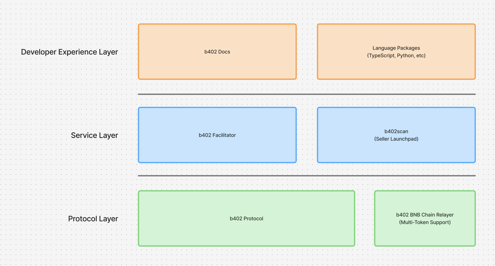

b402 is a complete internet-native payment infrastructure built on the [BNB Chain](https://www.bnbchain.org/en), inspired by the `HTTP 402` standard and [x402](https://x402.org) protocol.

It enables HTTP-native payment requests that support multi-token transactions, bringing frictionless payment capabilities to the BNB ecosystem.

## b402 Architecture

<Frame>
  
</Frame>

The b402 ecosystem integrates three key layers:

1. **Protocol Layer (b402 Protocol)**: the open payment protocol.
2. **Service Layer (Facilitator & b402scan)**: the operational backbone enabling settlement and onboarding.
3. **Developer Experience Layer (SDKs)**: the usability interface driving adoption.

## Why Use b402?

b402 addresses the friction between today’s web protocols and tomorrow’s autonomous systems:

* **Agent-to-agent (a2a) payments** made seamless with native crypto primitives
* **Low-fee micropayments** and usage-based monetization without custodians
* **Integrated identity** through ERC-8004 for verified agent transactions
* **BNB-native deployment** with compatibility toward EVM

## Who Is b402 For?

**Agents & Developers (Buyers):**
AI agents, bots, and scripts that need to autonomously pay for or charge for data, compute, or APIs.

**Service Providers (Sellers):**
Developers and businesses who want to monetize APIs or digital content directly over HTTP, without centralized gateways.

Both sellers and buyers interact directly through HTTP requests, with payment handled transparently through the protocol.

## What Can You Build?

b402 unlocks a new category of agent-native applications on the BNB Chain:

* **Autonomous API trading bots** that pay per query
* **AI agents** that purchase verified data feeds or inference time
* **Usage-based paywalls** for analytics, content, or utilities
* **Proxy or relay services** that resell API capabilities
* **Identity-gated endpoints** requiring ERC-8004 verification

## How It Works

The flow is simple and transparent:

1. A buyer (agent) requests a resource from a b402-enabled service.
2. If payment is required, the service responds with `402 Payment Required` and b402-formatted payment instructions.
3. The buyer sends a **payment payload** to the b402 facilitator for settlement.
4. The server verifies the transaction through `/verify` and `/settle` endpoints.
5. Once verified, the server releases the requested resource.

## Get Started with b402
<CardGroup cols={2}>

<Card title='Concepts' icon='book-open-cover' href='/concepts'>
    
</Card>

<Card title='Get Started' icon='play' href='/get-started'>
</Card>

</CardGroup>

## Contribute & Give Feedback

We love seeing new ideas, improvements, and documentation contributions flow back into b402.  
If you’ve spotted a bug, have a suggestion, or want to improve the docs, open a PR or issue.

<CardGroup cols={2}>
<Card title='b402 GitHub' icon='github' href='https://github.com/Vistara-Labs/b402'>
</Card>

<Card title='b402 Discord' icon='discord' href='https://discord.gg/JpCB9SbK'>
</Card>
</CardGroup>
